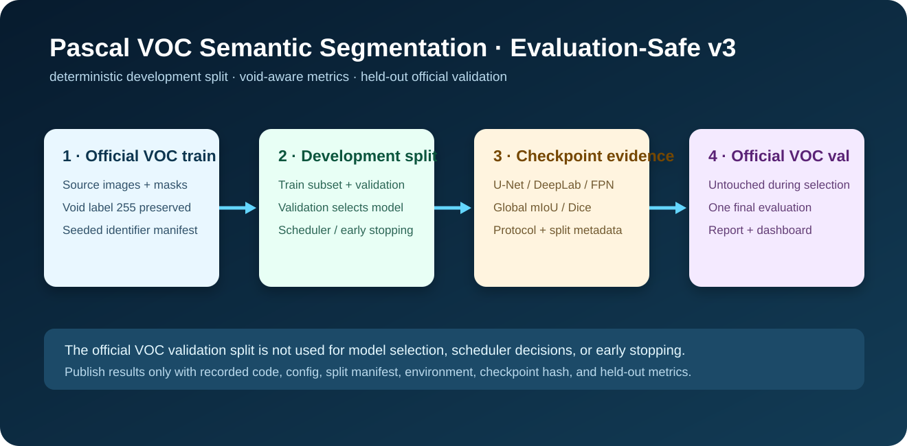

# Pascal VOC Semantic Segmentation — Evaluation-Safe Reference Pipeline

[](../../actions/workflows/ci.yml)
[](LICENSE)

A reproducible semantic-segmentation reference pipeline for **Pascal VOC 2012** using U-Net, DeepLabV3+, or FPN from `segmentation-models-pytorch`.

> **Protocol first.** Development model selection, early stopping, and scheduler decisions use a deterministic validation split derived only from official Pascal VOC `train`. The labeled official VOC `val` split is held out until one final evaluation. Raw data and model weights are never committed; any published result must include its configuration, split manifest, code commit, environment metadata, and artifact hashes.

## Why this revision exists

The earlier pipeline used the official VOC validation split both to select a checkpoint and to report its final score. That makes the score useful for development but not an untouched final estimate. The current protocol makes the distinction explicit:

1. split the official `train` identifiers deterministically into development train and development validation;
2. select the checkpoint only with development-validation mIoU;
3. evaluate the selected checkpoint only after selection on the untouched official `val` identifiers.

Other guarantees:

- Pascal VOC void pixels (`255`) remain void and are excluded from loss and metrics;
- metrics are accumulated from one dataset-level confusion matrix, not batch averages;
- checkpoints store model, protocol, split-count, task, and image-size metadata;
- evaluation rejects legacy checkpoints without held-out-protocol metadata;
- inference returns HTTP `503` when no valid local checkpoint exists;
- dashboards are generated only from recorded training history and held-out metrics.

## Visual overview



The diagram describes the current split-integrity workflow. It is a protocol visual, not a performance claim.

<details>
<summary><strong>Archived v1 visual gallery — qualitative context only</strong></summary>

These are genuine visuals retained from the pre-v2 repository. They remain useful qualitative context, but their numerical annotations are **not** current v3 results because void handling and evaluation protocol changed. See [`assets/legacy-v1/README.md`](assets/legacy-v1/README.md).


</details>

A current, reportable dashboard is generated only after a recorded v3 run from its configuration, split manifest, checkpoint metadata, training history, and one final official-validation evaluation.

## Data card

| Item | Value |
| --- | --- |
| Dataset | [Pascal VOC 2012](http://host.robots.ox.ac.uk/pascal/VOC/) segmentation |
| Development data | Official `train`, deterministically split into train and development validation |
| Final evaluation data | Official labeled `val`, untouched during model selection |
| Default task | Binary foreground/background: VOC classes 1–20 merged as foreground |
| Alternative task | Native `voc_multiclass` with `model.num_classes: 21` |
| Void pixels | Original `255`; ignored in loss and every metric |
| Primary selection metric | Development-validation mean IoU |
| Data location | `data/` (ignored by Git) |
| Intended use | Learning, evaluation, and a maintainable engineering reference |
| Not intended for | Medical, safety, industrial inspection, or deployment without task-specific validation, monitoring, and governance |

Pascal VOC has its own terms; review them before use. This repository's MIT code license does not relicense the dataset.

## Setup

Python **3.10–3.12** is recommended. Install an appropriate matching PyTorch/torchvision build from the [official PyTorch selector](https://pytorch.org/get-started/locally/) before project dependencies. A CPU-only example:

```bash
python -m venv .venv
# Windows PowerShell: .\.venv\Scripts\Activate.ps1
# macOS/Linux: source .venv/bin/activate
python -m pip install --upgrade pip
pip install torch==2.6.0 torchvision==0.21.0 --index-url https://download.pytorch.org/whl/cpu
pip install -r requirements-dev.txt
```

Download the data explicitly (about 2 GB) rather than hiding a transfer inside training:

```bash
python -m src.download_data
```

## Train, evaluate, and report

The default config uses the entire official source split and can be expensive on CPU.

```bash
# Train from official VOC train only and select only on development validation.
python -m src.train --config config.yaml

# Fast wiring check only: small subsets, one epoch, and not reportable.
python -m src.train --config config.yaml --smoke-test

# Once configuration/checkpoint selection are final, evaluate official VOC val once.
python -m src.evaluate --config config.yaml --checkpoint checkpoints/best.pt

# Create a dashboard only from those real experiment artifacts.
python -m src.reporting
```

Training writes:

```text
checkpoints/
├── best.pt                  # selected by development-validation mIoU
├── last.pt
├── split_manifest.json      # exact development and held-out identifiers
└── training_history.json
```

Evaluation writes `reports/heldout_val_metrics.json`; reporting writes `reports/experiment_dashboard.png`. Both local output paths remain ignored so unrelated runs cannot be accidentally committed. A reportable evidence bundle must contain the matching configuration, split manifest, checkpoint hash, code commit, seed, hardware, dependency versions, and explicit data provenance.

### What to report

Report at least:

- held-out official-validation mIoU and mean Dice;
- pixel accuracy, per-class IoU/Dice, support, and confusion matrix;
- development split seed and validation fraction;
- task definition, image resolution, hardware, run duration, and commit SHA.

Do not call the public VOC validation split an official test set; Pascal VOC test labels are not bundled with the public dataset. Do not compare scores across different task definitions, subsets, resolutions, or preprocessing as if they were the same benchmark.

### Switch to native 21-class VOC

Change task and output channels together, then retrain from scratch:

```yaml
dataset:
  task: voc_multiclass
model:
  num_classes: 21
```

A binary checkpoint cannot be evaluated as native multiclass VOC.

## Local API demo

After training a valid `checkpoints/best.pt`:

```bash
uvicorn src.inference:app --host 0.0.0.0 --port 8000
curl http://localhost:8000/health
curl -X POST http://localhost:8000/predict -F "file=@example.jpg" --output mask.png
curl -X POST http://localhost:8000/predict-overlay -F "file=@example.jpg" --output overlay.png
```

- `GET /health` reports `model_not_loaded` until a local checkpoint exists.
- `POST /predict` returns an original-size PNG label mask.
- `POST /predict-overlay` returns an original-size green overlay for non-background labels.
- Without a valid held-out-protocol checkpoint, prediction endpoints return HTTP `503` rather than random predictions.
- `CHECKPOINT_PATH` and `MAX_UPLOAD_BYTES` configure checkpoint location and upload size.

## Quality checks and benchmarking

```bash
pytest
ruff check src tests
python -m src.benchmark --model unet --encoder resnet18
```

GitHub Actions runs tests and linting on Python 3.11 with CPU PyTorch for every push and pull request. The benchmark measures the current host only; it is not a portable latency claim.

## Docker

```bash
docker build -t semantic-segmentation-pipeline .
docker run --rm -p 8000:8000 \
  -v "$(pwd)/checkpoints:/app/checkpoints:ro" \
  semantic-segmentation-pipeline
```

On Windows PowerShell, use `${PWD}` in place of `$(pwd)`. The health endpoint remains available without a model, but inference stays unavailable until a valid checkpoint is mounted.

## Repository layout

```text
├── config.yaml
├── src/
│   ├── data_loader.py       # VOC loaders and deterministic development split
│   ├── models.py            # model factory and void-aware losses
│   ├── metrics.py           # streaming dataset-level metrics
│   ├── train.py             # development-only checkpoint selection
│   ├── evaluate.py          # one final official-VOC-validation evaluation
│   ├── reporting.py         # dashboard generated from real artifacts
│   ├── inference.py         # checkpoint-safe FastAPI inference
│   └── download_data.py     # explicit local dataset download
├── tests/
├── checkpoints/
├── reports/
├── .github/workflows/ci.yml
├── Dockerfile
└── Makefile
```

## Citation

```bibtex
@article{everingham2010pascal,
  title={The Pascal Visual Object Classes (VOC) Challenge},
  author={Everingham, Mark and others},
  journal={International Journal of Computer Vision},
  year={2010}
}
```
