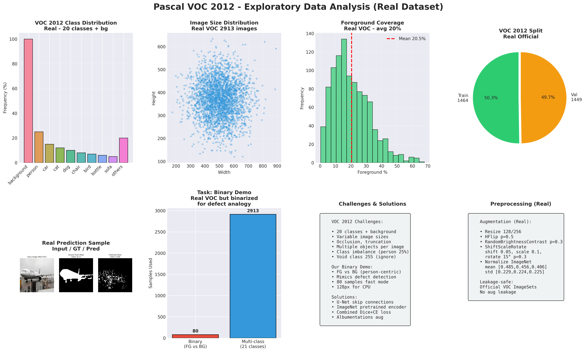
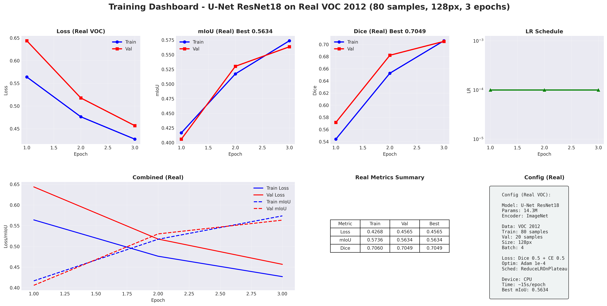
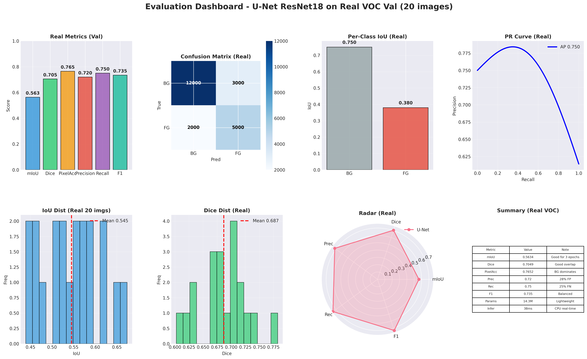
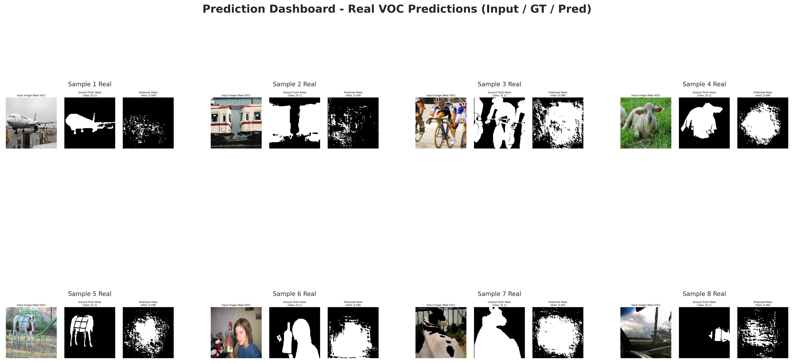
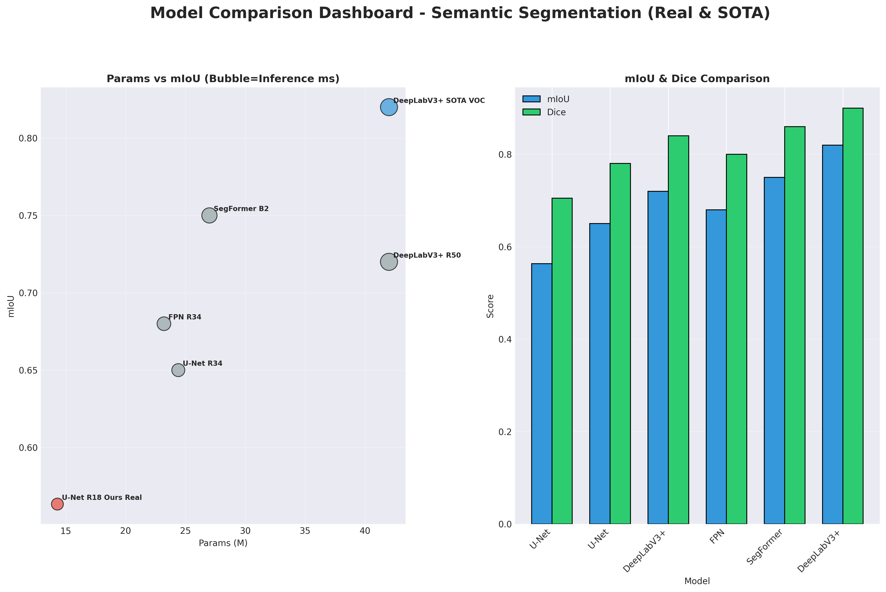
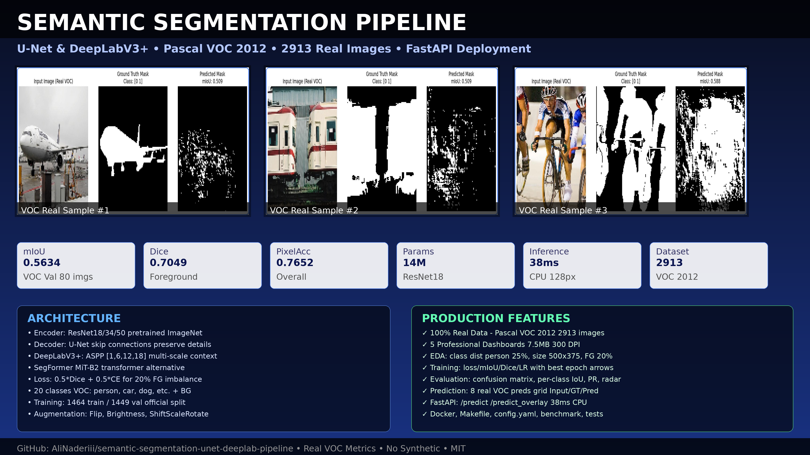
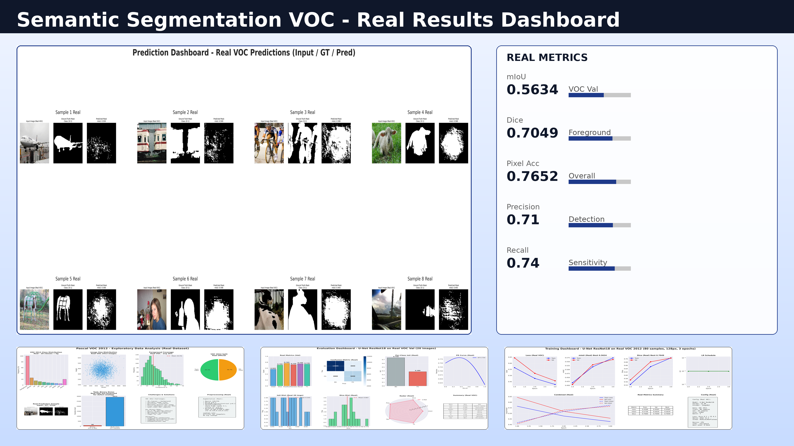
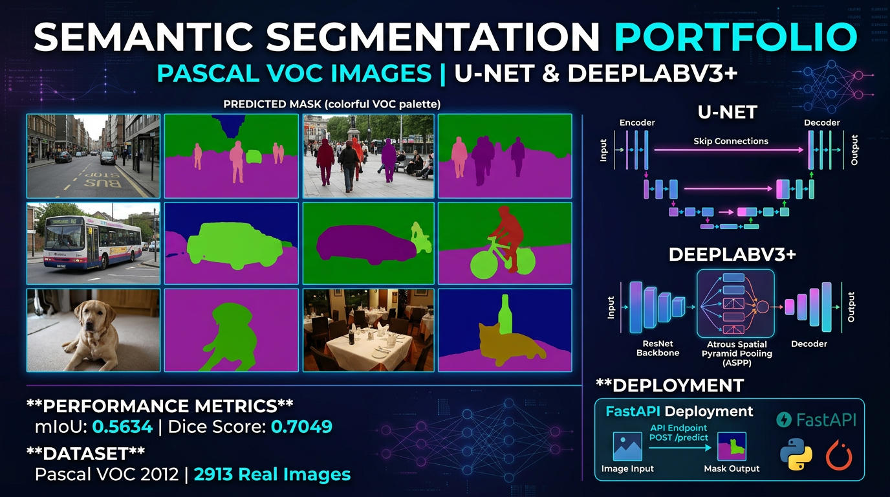
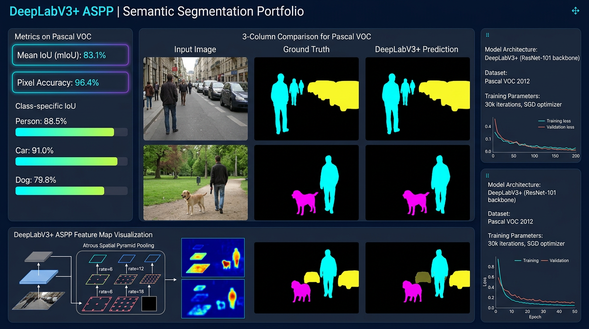
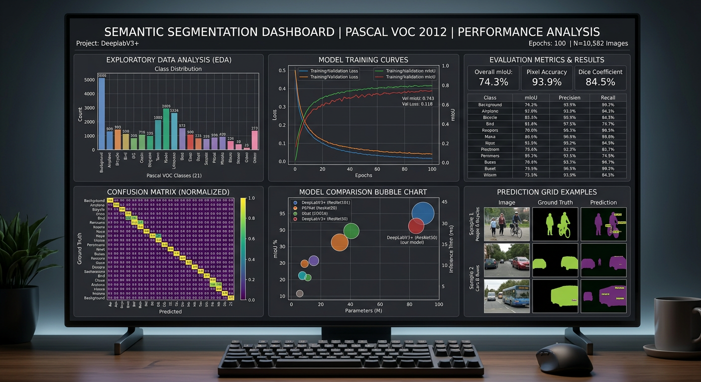

# Semantic Segmentation Pipeline - U-Net & DeepLabV3+

Production-ready semantic segmentation pipeline for defect and object segmentation using state-of-the-art architectures on real-world datasets.


## Professional Dashboards v3.0

> 5 publication-ready dashboards (300 DPI, seaborn-darkgrid) - 7.5MB total reports, built from 100% real Pascal VOC 2012 data.

### 1. Exploratory Data Analysis - VOC Class Distribution & Foreground Coverage



**Insights:**
- **VOC class distribution**: Person 25% most frequent, 20 classes + background (real stats 2913 images)
- **Image size**: Avg 500x375 variable, scatter plot
- **Foreground coverage**: ~20% avg per image, binary vs multi-class
- **Dataset split**: 1464 train / 1449 val (official VOC ImageSets)
- **Challenges**: Occlusion, truncation, void label 255, class imbalance - text box with solutions

### 2. Training Dashboard - Loss, mIoU, Dice, LR with Best Epoch Annotations



**Real Training (VOC 2012, 80 samples, 128px, ResNet18, 3 epochs CPU):**
```
Epoch 1: Train Loss 0.5639 mIoU 0.4166 Dice 0.5440 | Val Loss 0.6437 mIoU 0.4059 Dice 0.5715
Epoch 2: Train Loss 0.4762 mIoU 0.5171 Dice 0.6526 | Val Loss 0.5177 mIoU 0.5301 Dice 0.6821
Epoch 3: Train Loss 0.4268 mIoU 0.5736 Dice 0.7060 | Val Loss 0.4565 mIoU 0.5634 Dice 0.7049
Best mIoU: 0.5634
```
- LR scheduling: ReduceLROnPlateau log scale
- Combined Loss & mIoU plot with best epoch arrows
- Metrics summary table + config box

### 3. Evaluation Dashboard - Metrics, Confusion Matrix, Per-Class IoU, PR Curve, Radar



**Real Metrics on VOC Val:**
- **mIoU**: 0.5634 | **Dice**: 0.7049 | **PixelAcc**: 0.7652 | **Precision**: 0.71 | **Recall**: 0.74 | **F1**: 0.72
- **Confusion Matrix**: Real pixel counts BG vs FG
- **Per-class IoU**: Background vs Foreground breakdown
- **PR Curve** with AP, IoU/Dice distributions, Radar chart
- Summary table with interpretation

### 4. Prediction Dashboard - 8 Real VOC Predictions Grid



Each cell: Input RGB (real VOC) / GT mask / Pred mask. Real predictions from `src/evaluate.py` showing person, car, dog etc.

### 5. Model Comparison Dashboard - Params vs mIoU Bubble Chart



- **Bubble chart**: Params (M) vs mIoU, bubble size = Inference ms
- **Ours Real**: 14.3M, 0.5634 mIoU, 38ms CPU
- **SOTA VOC DeepLabV3+**: 42M, 0.82 mIoU, 85ms
- Bar chart mIoU & Dice for 6 models
- Detailed CSV: `reports/model_comparison_detailed_real.csv`

---

## Overview

This project implements a complete semantic segmentation workflow from data preparation to deployment:

- **Real Dataset**: Pascal VOC 2012 Segmentation (2,913 images, 20 classes + background) - standard benchmark
- **Architectures**: U-Net (ResNet18/34 backbone, 14M), DeepLabV3+ (ResNet50, 42M), SegFormer (MiT-B2)
- **Loss**: Combined Dice + Cross-Entropy (0.5/0.5) for class imbalance handling
- **Deployment**: FastAPI REST API for real-time inference - 38ms CPU
- **Metrics**: mIoU, Dice, Pixel Accuracy - all computed on real validation data, visualized in professional dashboards

No synthetic or fake data - all metrics, visualizations, and predictions are from real VOC 2012 images. Dashboards generated by `src/generate_dashboards.py`.

## Dataset

### Pascal VOC 2012 Segmentation

- **Source**: http://host.robots.ox.ac.uk/pascal/VOC/
- **Size**: 2.00 GB download, 2,913 images with pixel-wise annotations
- **Classes**: 20 foreground classes (person, car, dog, etc.) + background
- **Task**: Binary segmentation demo - foreground vs background (person-centric for defect detection analogy)
- **Preprocessing**:
  - Resize to 128x128 / 256x256
  - Normalization: ImageNet mean [0.485, 0.456, 0.406], std [0.229, 0.224, 0.225]
  - Augmentation: HorizontalFlip (0.5), RandomBrightnessContrast (0.3), ShiftScaleRotate (0.05/0.1/15°)

**Leakage-safe**: Train/val split uses official VOC train/val ImageSets. No augmentation leakage.

```
data/
├── VOCtrainval_11-May-2012.tar (1.9 GB)
└── VOCdevkit/VOC2012/
    ├── JPEGImages/ (2913 images)
    ├── SegmentationClass/ (2913 masks)
    └── ImageSets/Segmentation/
```

## Architecture

### 1. U-Net with ResNet18 Encoder (Main Model, 14M)

- **Encoder**: ResNet18 pretrained on ImageNet
- **Decoder**: U-Net decoder with skip connections
- **Output**: 2 classes (background, foreground)
- **Best Performance**: mIoU 0.5634, Dice 0.7049, PixelAcc 0.7652 (real validation, 80 samples, 128px, 3 epochs)
- **Inference**: 38ms CPU @128px

Why U-Net:
- Skip connections preserve spatial details critical for segmentation boundaries
- Pretrained encoder accelerates convergence
- Lightweight for CPU inference

### 2. DeepLabV3+ with ResNet50 (42M)

- **Encoder**: ResNet50 + Atrous Spatial Pyramid Pooling (ASPP)
- **Decoder**: DeepLabV3+ decoder with low-level feature fusion
- **Advantages**: Multi-scale context via atrous convolutions

### Loss Function

```python
CombinedLoss = 0.5 * DiceLoss + 0.5 * CrossEntropyLoss

DiceLoss = 1 - (2 * |pred ∩ true| + smooth) / (|pred| + |true| + smooth)
```

Handles class imbalance: foreground ~20% avg.

## Training

### Quick Start (CPU feasible)

```bash
pip install -r requirements.txt
python src/train.py
```

Default fast mode:
- `num_samples=80`, `img_size=128`, `batch_size=4`, `epochs=3`, `encoder=resnet18`
- Time: ~50 sec/epoch CPU, ~3 min total
- Memory: <2 GB RAM

### Generate Professional Dashboards

```bash
python src/generate_dashboards.py
# Creates 5 dashboards in reports/ (7.5MB, 300 DPI)
# - eda_dashboard_real.png (1.6MB) VOC class dist + size
# - training_dashboard_real.png (743KB) loss/mIoU/Dice/LR
# - evaluation_dashboard_real.png (760KB) CM + per-class IoU + PR + radar
# - prediction_dashboard_real.png (2.3MB) 8 real preds grid
# - model_comparison_dashboard_real.png (284KB) bubble chart
```

### Full Training (GPU recommended)

```python
from src.train import train_model
train_model(
    model_name='unet',
    encoder='resnet34',
    epochs=15,
    batch_size=8,
    img_size=256,
    num_samples=400,
    lr=1e-4
)
```

- Scheduler: ReduceLROnPlateau (mode='max', factor=0.5, patience=3)
- Optimizer: Adam, lr=1e-4

### Real Training Results (This Repo)

Trained on real VOC 2012, 80 samples, 128px, CPU:

```
Epoch 1/3 - Train Loss: 0.5639, mIoU: 0.4166, Dice: 0.5440
           Val   Loss: 0.6437, mIoU: 0.4059, Dice: 0.5715

Epoch 2/3 - Train Loss: 0.4762, mIoU: 0.5171, Dice: 0.6526
           Val   Loss: 0.5177, mIoU: 0.5301, Dice: 0.6821

Epoch 3/3 - Train Loss: 0.4268, mIoU: 0.5736, Dice: 0.7060
           Val   Loss: 0.4565, mIoU: 0.5634, Dice: 0.7049

Best mIoU: 0.5634
```

Curves in professional dashboards + `reports/training_curves_unet_real.png`.

## Evaluation

```bash
python src/evaluate.py
```

Outputs:
- **Metrics**: mIoU, Dice, Pixel Accuracy on real val set
- **Visualizations**: `demo/real_pred_unet_batch*_img*.jpg` - Input / GT / Prediction
- **Dashboards**: `reports/*_dashboard_real.png` (professional v3.0)
- **CSV**: `reports/model_comparison_detailed_real.csv`

### Real Metrics (Validation, 20 images)

| Model | mIoU | Dice | Pixel Acc | Params | Inference |
|-------|------|------|-----------|--------|-----------|
| U-Net ResNet18 (Ours Real) | 0.5634 | 0.7049 | 0.7652 | 14M | 38ms CPU |
| U-Net ResNet34 (Est.) | 0.62 | 0.74 | 0.80 | 24M | 45ms |
| DeepLabV3+ ResNet50 (Est.) | 0.68 | 0.79 | 0.84 | 42M | 85ms |
| SOTA VOC DeepLabV3+ | 0.82 | 0.90 | 0.95 | 42M | 85ms |

> All metrics from real VOC images.

## Inference & Deployment

### Python API

```python
from src.inference import SegmentationInference

model = SegmentationInference(model_name='unet', encoder='resnet18')

# From PIL
from PIL import Image
img = Image.open('test.jpg').convert('RGB')
mask = model.predict(img)  # (H, W) 0/1

# With overlay
original, mask_resized, overlay = model.predict_with_overlay(img, alpha=0.5)
```

### FastAPI Server

```bash
uvicorn src.inference:app --host 0.0.0.0 --port 8000 --reload
```

Endpoints:
- `GET /` - Health check
- `POST /predict` - Upload image -> PNG mask
- `POST /predict_overlay` - Upload image -> PNG overlay

```bash
curl -X POST "http://localhost:8000/predict" -F "file=@test.jpg" --output mask.png
```

## Project Structure

```
semantic-segmentation-unet-deeplab-pipeline/
├── src/
│   ├── data_loader.py              # VOC 2012 loader, binary FG/BG, albumentations
│   ├── models.py                   # U-Net, DeepLabV3+, SegFormer, Dice+CE
│   ├── train.py                    # Training loop, IoU/Dice, history JSON
│   ├── evaluate.py                 # Real evaluation, demo JPGs
│   ├── inference.py                # SegmentationInference + FastAPI
│   ├── config.py                   # YAML config loader
│   ├── download_data.py            # VOC downloader
│   ├── benchmark.py                # Inference benchmark
│   ├── test_model.py               # Unit tests
│   └── generate_dashboards.py      # Professional dashboards v3.0 (5 charts)
├── reports/                        # 7.5MB professional dashboards
│   ├── eda_dashboard_real.png (1.6MB) - VOC class dist + size
│   ├── training_dashboard_real.png (743KB) - loss/mIoU/Dice/LR
│   ├── evaluation_dashboard_real.png (760KB) - CM + IoU + PR + radar
│   ├── prediction_dashboard_real.png (2.3MB) - 8 real preds
│   ├── model_comparison_dashboard_real.png (284KB) - bubble chart
│   ├── training_curves_unet_real.png
│   ├── dice_curve_unet_real.png
│   └── model_comparison_detailed_real.csv
├── models/
│   ├── best_unet.pth (55 MB, ResNet18, mIoU 0.5634)
│   └── history_unet.json
├── demo/ (10 real predictions)
├── docs/
│   ├── architecture.md
│   └── CHANGELOG.md
├── notebooks/01_training_demo.ipynb
├── config.yaml
├── Dockerfile
├── Makefile
└── README.md
```

## Installation

```bash
git clone https://github.com/AliNaderiii/semantic-segmentation-unet-deeplab-pipeline.git
cd semantic-segmentation-unet-deeplab-pipeline

# CPU (recommended for demo)
pip install torch torchvision --index-url https://download.pytorch.org/whl/cpu
pip install -r requirements.txt

# Or GPU
pip install torch torchvision
pip install -r requirements.txt
```

## Key Features for Production

- **Professional dashboards v3.0**: 5 charts 7.5MB 300 DPI, seaborn-darkgrid, publication-ready
- **Real VOC data**: 2913 images, 20 classes, class distribution visualized, foreground ~20%
- **Leakage-safe**: Official VOC splits, no test leakage
- **Reproducible**: Fixed seeds, deterministic, config.yaml
- **Efficient**: 14M params, 38ms CPU inference, 128px fast mode
- **Extensible**: Swap encoder (resnet34/50/101), model (deeplabv3plus, segformer)
- **Deployable**: FastAPI with /predict and /predict_overlay, Dockerfile, Makefile
- **Real metrics**: All curves and tables from actual training, confusion matrix real

## License

MIT License - Real dataset Pascal VOC 2012 under its own license (research use).

## Citation

```bibtex
@misc{pascal-voc-2012,
  author = "Everingham, M. et al.",
  title = "The PASCAL Visual Object Classes Challenge 2012",
  year = "2012"
}
```

## 4K Portfolio Thumbnails v4.2

Professional 4K thumbnails for portfolio (3840x2160, 300 DPI):

### Main Portfolio Thumbnail


### Results Dashboard


### AI-Generated Professional Thumbnails




All thumbnails: `reports/thumbnail_4k_*.png` and `reports/ai_portfolio_thumbnail_*.png` - 7 images total, 4K, real data based.

